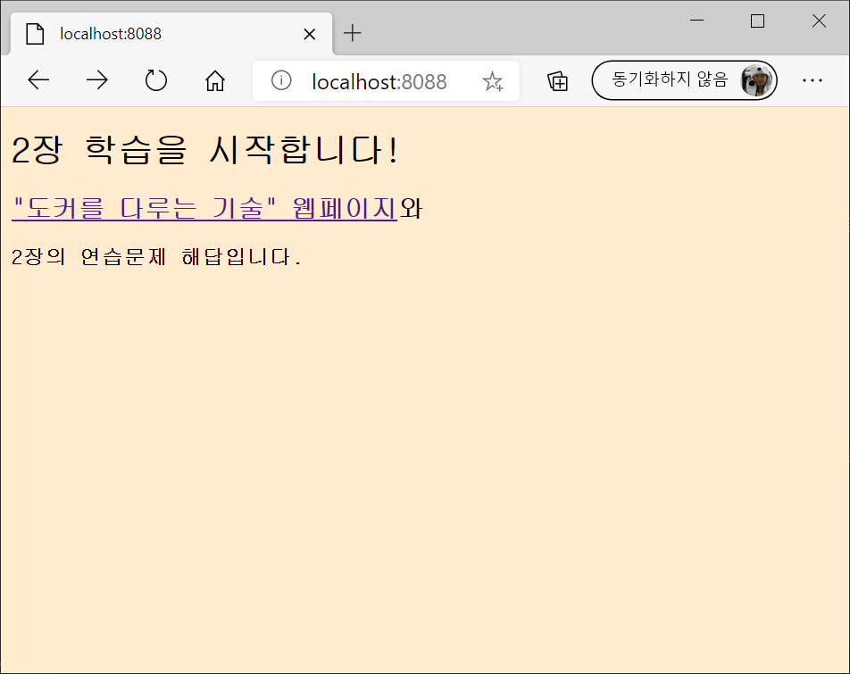

# 도커를 다루는 기술 2장 연습문제 - 해답

1. 실습에서 사용했던 웹 컨테이너를 실행한다.

```
> docker container run --detach --publish 8088:80 diamolkor/ch02-hello-diamol-web
86b20cd8e846d7ea8cf29d08d8c22118f925cca818ab28765d218c7585dbc52d
```

> 이후 명령에서 이 컨테이너를 지정할 수 있도록 컨테이너 ID를 적어두자. 위의 경우 `86b`까지만 적으면 된다.

2. _[비필수]_ 컨테이너 안에 HTML 페이지가 정해진 경로에 있는지 확인한다.

- 리눅스에서는 `ls` 명령을 사용하면 된다.

```
> docker container exec 86b  ls /usr/local/apache2/htdocs
index.html
```

- 윈도우에서는 `dir` 명령을 사용한다. 그러나 먼저 `cmd` 명령을 앞에 붙여주어야 한다.

```
docker container exec 86b cmd /s /c dir C:\usr\local\apache2\htdocs
index.html
```

3. 컨테이너 안에 HTML 파일의 경로를 이미 알고 있으므로 `docker container cp` 명령으로 로컬 컴퓨터의 파일을 컨테이너 안으로 복사할 수 있다. 이 명령으로 컨테이너 안에 있는 파일 `index.html`이 로컬 컴퓨터에 있는 파일로 덮어써진다.

```
docker container cp index.html 86b:/usr/local/apache2/htdocs/index.html
```

`cp` 명령의 인자는 `[source path] [target path]`다. 컨테이너가 원본 및 사본 경로가 될 수 있으며, 컨테이너 경로를 지정하려면 경로 앞에 컨테이너 식별자(`86b`)를 앞에 붙여준다. 리눅스와 윈도우 모두 경로 구분자로 슬래시(/)를 사용한다.

> 윈도우 10에서 윈도우 컨테이너를 사용한다면 _filesystem operations against a running Hyper-V container are not supported_라는 오류 메시지가 나오는 경우가 있다. 이 오류 메시지를 보았다면 `docker container cp` 명령을 사용하기 전에 `docker container stop <id>` 명령으로 컨테이너를 중지시켜야 한다. 이후 다시 `docker container start <id>` 명령으로 컨테이너를 재시작한다.

4. 공개된 포트인 http://localhost:8088에 접근해 보면 웹 페이지가 수정되었음을 알 수 있다.




## 메모

컨테이너에 포함된 아파치 웹 서버는 지정된 위치에 있는 HTML 파일의 내용을 응답으로 돌려준다. 우리가 로컬 컴퓨터에 있는 수정된 파일로 이 HTML 파일을 덮어썼으므로 웹 페이지의 내용이 변경된 것이다.

그러나 도커 이미지에 포함된 HTML 파일이 수정된 것은 아니라, 이 컨테이너에 포함된 파일만 수정된 것이기 때문에 현재 컨테이너를 삭제하고 새 컨테이너를 실행하면 다시 웹 페이지의 내용이 원래대로 돌아간다.